# 	<center>**区块链基础及应用实验报告**</center>

## <center>**去中心化应用程序(DApp)**</center>


## <center> **2212422 孙启森 2213483常欣然**</center>

# 一、实验要求

使用Solidity和web3.js在以太坊（Ethereum）上实现一个复杂的去中心化应用程序(DApp)。编写一个智能合约和访问它的用户客户端，学习DApp的“全栈”开发。


# 二、实验过程

## （一）环境配置

安装 `Node.js`，运行 `npm install -g Ganache-CLI` 来安装`Ganache-CLI`。运行`ganache-cli`来运行节点.
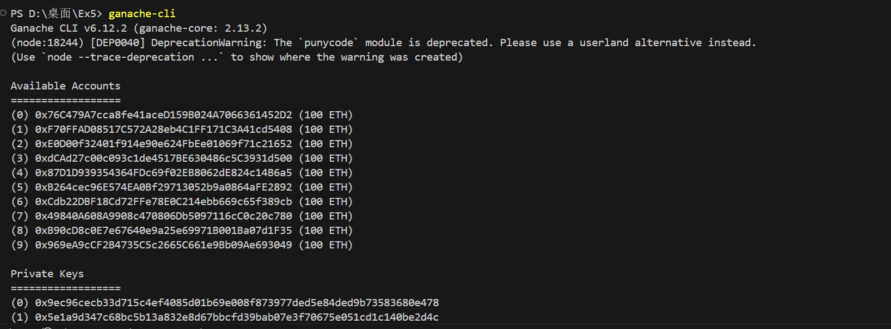
## （二）智能合约

使用 `Solidity` 语言在 `REMIX` 平台上完成了智能合约的编写。
首先仿照Solidity文档中给出的示例指定源代码Solidity 版本。在示例中还包含`// SPDX-License-Identifier: GPL-3.0`告诉源代码是根据 GPL 版本 3.0 授权的。但是在运行时发现增添这句会部署失败，因此删去了本句。
```solidity
pragma solidity >=0.4.16 <0.9.0;
```
为了更好地完成操作，我们采用了一下操作

  ```solidity
  struct debt{
        uint32 value;//债务
    }
   mapping(address=>mapping(address=>debt)) internal debt_map;
  ```
* 定义了 `debt` 结构体，其包含一个32位地无符号整数`value`用来代表债务 。
* 定义了一个映射结构，用于表示的债务图的结构。

  * 使用 `debt_map[debtor][creditor]` 得到一个 `debt_map` 结构体，表示债务人 `debtor` 欠债权人 `creditor` 的债务情况。设置为internal内部访问。
 
接着实现了 **`lookup`** 函数，用于查询返回债务人欠债权人的金额。

```solidity
 function lookup(address debtor, address creditor) public view returns (uint32 ret)//查找
    {
        ret=debt_map[debtor][creditor].value;
    }
```
*  这里的`public`表示可以从合约外部调用，而 `view` 表示函数只读，不会修改合约的状态。

接着实现了 **`add_IOU`** 函数，为调用者添加一个欠条，如果已经欠钱，金额会增加。金额必须为正数。
 ```solidity
    function add_IOU(address creditor, uint32 amount, address[] memory path, uint32 min_path) public {//债权人，新增债务，path，path中用以消除债务的值
    require(amount > 0, "Amount must >0");
    address debtor = msg.sender;  
    require(debtor != creditor, "Creditor cannot = debtor.");
    
    debt storage mydebt =debt_map[debtor][creditor];
    if(min_path==0){
        mydebt.value+=amount;
        return;
    } 
    require((mydebt.value+amount) >= min_path, "min_path need to be the smallest");
    require(creditor == path[0] && debtor == path[path.length - 1], "The path is wrong!");
    for(uint256 i = 0; i < path.length - 1; i++)
        {
            debt storage currentDebt = debt_map[path[i]][path[i + 1]];
            require(currentDebt.value != 0, "debt is 0");
            require(currentDebt.value >= min_path, "min_ptah is bigger than this debt");
            currentDebt.value -= min_path;
        }

        mydebt.value += amount - min_path;
}
 ```

* 为了保证健全性，我们实行了一系列检查基本检查，如amount必须大于0.同时债务人和债权人不能为同一人等。

* 在进行消债时，同样进行了检查，判断债务循环中可消除债务是否为0。为0则直接加债务即可
* 当不为0时，则会进行消债，同样会检查要消除的是否会大于当前债务加上增加债务，若不大于则会进入循环消债
* 消债前会先判断债务图是否正确，然后会在循环中进行消债，循环中同样会执行检查。
* 在最后则会对债务值进行更新

为减少gas的使用，我们在循环时使用` debt storage currentDebt = debt_map[path[i]][path[i + 1]];`以便于减少开销。同时我们对于数据类型采用足够就行，而不是设置过长的位数。对于判断则尽可能采用require。
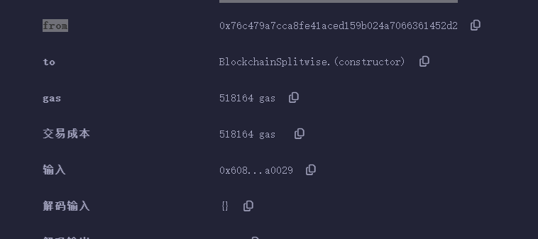
查看gas可以看到比较合理。
随后我们将编译后的ABI粘贴到script.js中
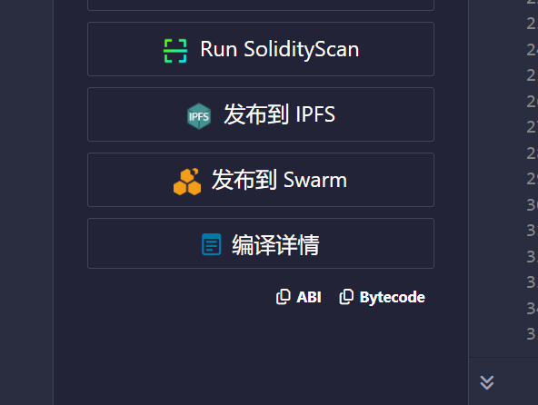
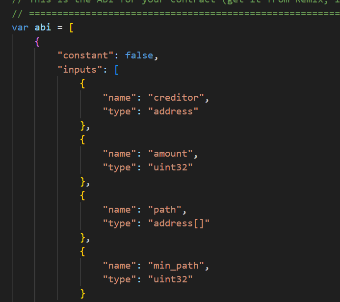
之后将部署合约的address添加
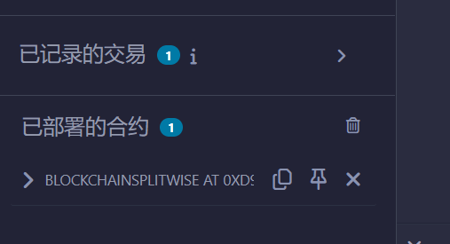
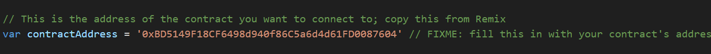
## （三）客户端
1. 编写 getData 函数，用于从合约中的 add_IOU 函数调用中提取数据。
   - 使用 map 函数遍历所有函数调用，应用 dataExtractor 函数提取数据，然后使用 flat 转换为一维数组，最后去重并返回。
   ```js
   function getData(dataExtractor, stopCondition) {
        const Calls = getAllFunctionCalls (contractAddress, 'add_IOU', stopCondition);
        const Result = Calls.map(Call =>     dataExtractor(Call)).flat();
        return Array.from(new Set(Result));
   }
   ```
2. 修改 getAllFunctionCalls 函数，增加参数earlyStopFn，earlyStopFn 是一个回调函数，它接受每个新的函数调用（function_calls[function_calls.length - 1]）作为参数，并返回一个布尔值。
   - 如果 earlyStopFn 返回 true，那么 getAllFunctionCalls 函数会立即停止遍历，提前返回当前已收集的 function_calls。
   - 如果 earlyStopFn 返回 false 或不传递 earlyStopFn，则函数会继续遍历区块，直到遍历完所有区块或到达起始区块（GENESIS）。
   ```js
   function getAllFunctionCalls(addressOfContract, functionName, earlyStopFn)
   {
	   let curBlock = web3.eth.blockNumber;
	   let function_calls = [];
	   while (curBlock !== GENESIS)
	   {
		   let b = web3.eth.getBlock(curBlock, true);
		   let txns = b.transactions;
		   for (let j = 0; j < txns.length; j++)
		   {
			   let txn = txns[j];
			   // check that destination of txn is our contract
			   if (txn.to === addressOfContract.   toLowerCase())
			   {
				   let func_call = abiDecoder.decodeMethod(txn.input);
				   // check that the function getting called in this txn is 'functionName'
				   if (func_call && func_call.name === functionName)
				{
					   let args = func_call.params. map(function (x) { return x.value });
					   function_calls.push({from: txn.from, args: args,   timestamp: b.timestamp,})
					   if (earlyStopFn && earlyStopFn   (function_calls [function_calls.length - 1]))
					   {
						   return function_calls;
					   }
				   }
			   }
		   }
		   curBlock = b.parentHash;
	   }
	   return function_calls;
   }
   ```
3. 编写 getCreditors 函数，用于获取与 user 有关的债权人。
   - 调用 getData 函数，提取了所有 add_IOU  函数调用中的债权人信息。
   - 使用 filter 函数，通过调用 BlockchainSplitwise 函数获取 user 在 creditor 处的债务金额，筛选出债务金额大于 0 的债权人并返回。
   ```js
   function getCreditors(user) {
        const Creditors = getData(Call => [Call.args?.[0].toLowerCase()], null);
        return Creditors.filter(creditor => BlockchainSplitwise.lookup(user, creditor).toNumber() > 0);
    }
   ```
4. 编写 getUsers 函数，用于获取合约中 add_IOU 函数调用涉及的债务人与债权人，并将其作为列表返回。
   - 调用 getData 函数，提取了所有 add_IOU 函数调用中的债务人和债权人信息。
   ```js
   function getUsers() {
        return getData(Call => [Call.from.toLowerCase(), Call.args?.[0].toLowerCase()], null);
   }
   ```
5. 编写 getTotalOwed 函数，计算 user 欠所有债权人的总额并返回。
   - 调用 getData 函数，提取了所有 add_IOU 函数调用中的债务人和债权人信息。
   - 使用 reduce 函数对所有债权人进行迭代，累加每个债权人对特定用户的债务金额然后返回。
   ```js
   function getTotalOwed(user) {
        const Creditors = getData(Call => [Call.args?.[0].toLowerCase()], null);
        return Creditors.reduce((acc, creditor) => acc + BlockchainSplitwise.lookup(user, creditor).toNumber(), 0);
   }
   ```
6. 编写 getLastActive 函数，用于返回 user 最后一次活动的 UNIX 时间戳。
   - 调用 getData 函数，提取了所有 add_IOU 函数调用中涉及到特定用户的时间戳信息。
   - 使用 Math.max 函数找到数组中的最大时间戳，即特定用户最后一次活动的时间戳，然后返回。
   ```js
   function getLastActive(user) {
        const timeStamp = getData(Call => (Call.from.toLowerCase() === user.toLowerCase() || Call.args?.[0].toLowerCase() === user.toLowerCase()) ? [Call.timestamp] : [], Call => Call.from.toLowerCase() === user.toLowerCase() || Call.args?.[0].toLowerCase() === user.toLowerCase());
        return Math.max(...timeStamp);
   }
   ```
7. 编写 add_IOU 函数，用于向合约中添加一个债务记录。
   - 调用 doBFS 函数，查找从 creditor 到 web3.eth.defaultAccount 的路径，且节点是债权人的集合。
   - 如果找到有效路径，则将 minDebt 初始化为无穷大。
       - 接着遍历路径上的节点，获取相邻节点间的债务记作 Debt，通过 Math.min 来找到路径上最小的债务。
       - 将路径上最小债务和输入的债务金额之间的较小值设置为 finalDebt。
       - 调用 BlockchainSplitwise.add_IOU 函数，向区块链添加债务信息。
   - 如果没找到有效路径，则调用 BlockchainSplitwise.add_IOU 函数，向区块链添加债务信息，其中 finalDebt 设置为 0。
  ```js
  function add_IOU(creditor, amount) {
        const Path = doBFS(creditor, web3.eth.defaultAccount, getCreditors);
        if (Path)
	    {
            let minDebt = Infinity;
            for (let i = 1; i < Path.length; i++)
		    {
                const Debt = BlockchainSplitwise.lookup(Path[i - 1], Path[i]).toNumber();
                minDebt = Math.min(minDebt, Debt);
            }
            const finalDebt = Math.min(minDebt, amount);
            return BlockchainSplitwise.add_IOU(creditor, amount, Path, finalDebt);
        }
        return BlockchainSplitwise.add_IOU(creditor, amount, [], 0);
    }
  ```


# 三、实验结果
首先让8号（0x53d23230a9f73f562cfd6134e20a662b9cf2a35a）向9号（0xe84d4b1b9db08bf20eacec2950e75f3b9b233c17）借15$
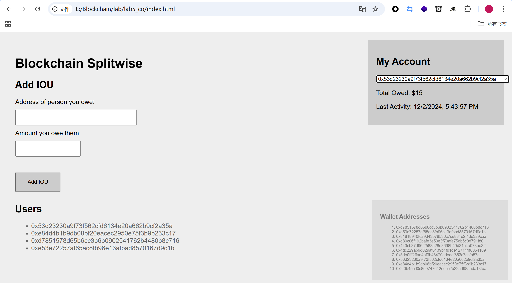

接下来让9号（0xe84d4b1b9db08bf20eacec2950e75f3b9b233c17）向10号（0x2f0b45cd0c8e0747612eecc2b22ad98aada18fea）借11$
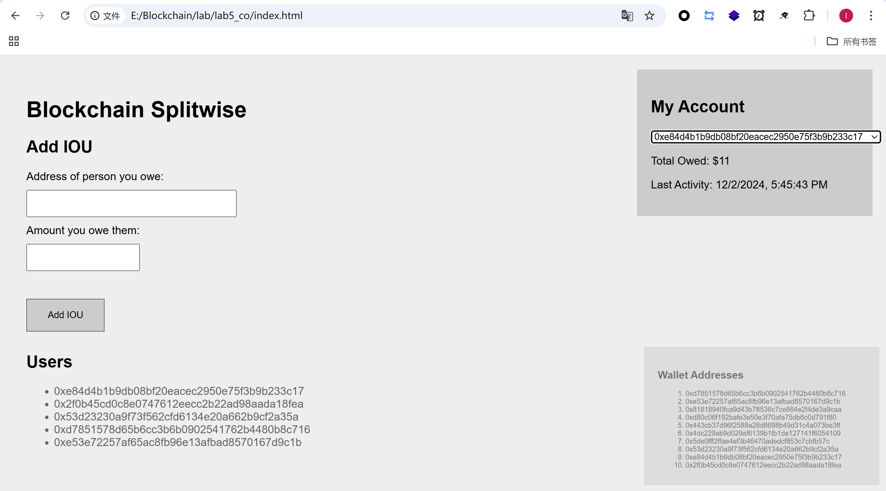

接下再让10号（0x2f0b45cd0c8e0747612eecc2b22ad98aada18fea）向8号（0x53d23230a9f73f562cfd6134e20a662b9cf2a35a）借9$时，会形成债务循环如下所示
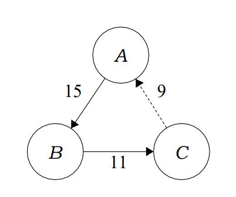

此时消去最小欠债金额，理论上的欠债关系应当为9号欠8号6$，10号欠9号2$，三人负债金额如下所示，与理论结果完全一致
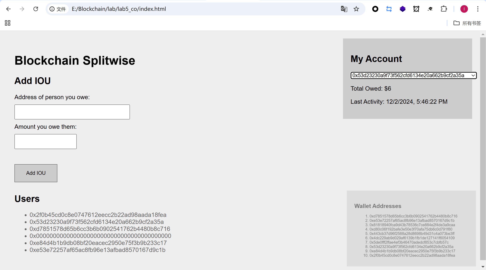
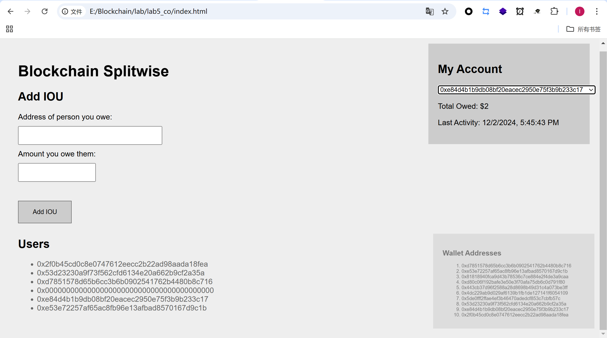


此时三人债务关系变为下图
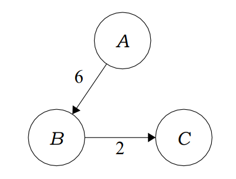

于是，通过我们的代码，可以成功将存在的债务循环进行化简，下图为上述例子的图形展示
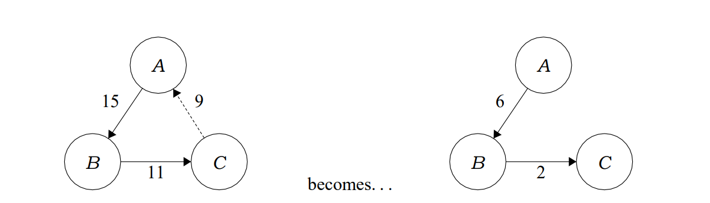


