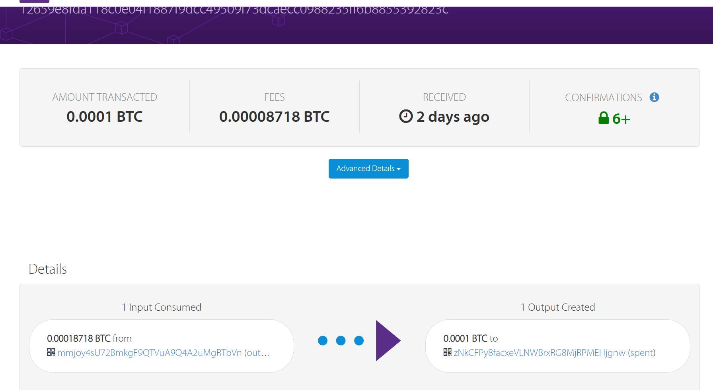
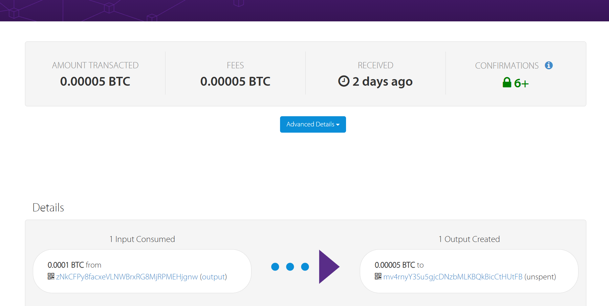

<h1 align = "center">ex2实验报告</h1>
<h4 align = "center">孙启森 2212422</h4>

## 一、实验目的
  生成一个涉及四方的多签名交易，这样交易可以由第一方（银行）与另外三方（客户）
中的任何一方（客户）共同赎回，而不仅仅只是客户或银行。对于这个问题，你可以假设是
银行的角色，这样银行的私钥就是你的私钥，而银行的公钥就是你的公钥。使用 keygen.py
生成客户密钥并将它们粘贴到 ex2a.py 中。（b）赎回事务并确保 scriptPubKey 尽可能小。
可以使用任何合法的签名组合来赎回交易至 faucet 地址，但要确保所有组合都有效。
## 二、实验内容

### 1.ex2a
在ex2a中我们要完成一个多重签名脚本，因为我们需要由银行以及三方交易中的任意一方即可共同赎回，因此我们采用的2-of-4的多重签名地址，这样只要四方中的两方提供私钥签名即可进行赎回。
```python
     ex2a_txout_scriptPubKey = CScript([
    2,  
    my_public_key,
    cust1_public_key,
    cust2_public_key,
    cust3_public_key,
    4,  
    OP_CHECKMULTISIG
])
 
```
实现交易

```python
if __name__ == '__main__':
    ######################################################################
    # TODO: set these parameters correctly
    amount_to_send = 0.0001
    txid_to_spend = (
        '9ad7b3bafb860ccfaa5348f09d22e5e9ceabdef4e601852f8b6b81f35eedf3f3')
    utxo_index = 1
    ######################################################################

    response = send_from_P2PKH_transaction(
        amount_to_send, txid_to_spend, utxo_index,
        ex2a_txout_scriptPubKey)
    print(response.status_code, response.reason)
    print(response.text)
```
与上次一样，填写我们需要交易的txid，这里send时采用我们的多重签名。

### 2.ex2b

```python
  # TODO: Complete this script to unlock the BTC that was locked in the
    # multisig transaction created in Exercise 2a.
    return [OP_0,bank_sig ,cust1_sig]   
```
在这里我们提供了银行和其中一个客户的签名来进行赎回。
### 4.运行结果
#### 交易结果
```python
201 Created
{
  "tx": {
    "block_height": -1,
    "block_index": -1,
    "hash": "12659e8fda118c0e04f1887f9dcc49509f73dcaecc0988235ff6b8855392823c",
    "addresses": [
      "mmjoy4sU72BmkgF9QTVuA9Q4A2uMgRTbVn",
      "zNkCFPy8facxeVLNWBrxRG8MjRPMEHjgnw"
    ],
    "total": 10000,
    "fees": 8718,
    "size": 306,
    "vsize": 306,
    "preference": "low",
    "relayed_by": "221.238.245.38",
    "received": "2024-10-15T09:27:52.047092816Z",
    "ver": 1,
    "double_spend": false,
    "vin_sz": 1,
    "vout_sz": 1,
    "confirmations": 0,
    "inputs": [
      {
        "prev_hash": "9ad7b3bafb860ccfaa5348f09d22e5e9ceabdef4e601852f8b6b81f35eedf3f3",
        "output_index": 1,
        "script": "483045022100e786d3321562292cc52ef1a29933701e0a14abcf10c41eda9c05659023fd5848022045ef3eff69d113d3ddaa94ef828b52e61395ba2fc359564a6671d5b7acf96021012103fb43c50a150e6c643959142043ea769a19008d15eb97600f0b6709a22ec06449",
        "output_value": 18718,
        "sequence": 4294967295,
        "addresses": [
          "mmjoy4sU72BmkgF9QTVuA9Q4A2uMgRTbVn"
        ],
        "script_type": "pay-to-pubkey-hash",
        "age": 3055955
      }
    ],
    "outputs": [
      {
        "value": 10000,
        "script": "522103fb43c50a150e6c643959142043ea769a19008d15eb97600f0b6709a22ec0644921033028cf8266b207fc4fe2321c9480c9cb02e893fa8cb54ceb99763212dce54f922102cf8a3c7cd79f122e1cfb77e56ea90dce230f175910ddffbc1b211ed6e640d1502103b73ebb5da9502906ee734a89c8f63a775b1813d6e81d067de9f67cb71371361b54ae",
        "addresses": [
          "zNkCFPy8facxeVLNWBrxRG8MjRPMEHjgnw"
        ],
        "script_type": "pay-to-multi-pubkey-hash"
      }
    ]
  }
}
```
赎回结果
```python
201 Created
{
  "tx": {
    "block_height": -1,
    "block_index": -1,
    "hash": "bf0be3bd0afee5269463d37f6ce506a3c5a44076c973d022d4d25a900679daf8",
    "addresses": [
      "mv4rnyY3Su5gjcDNzbMLKBQkBicCtHUtFB",
      "zNkCFPy8facxeVLNWBrxRG8MjRPMEHjgnw"
    ],
    "total": 5000,
    "fees": 5000,
    "size": 231,
    "vsize": 231,
    "preference": "low",
    "relayed_by": "221.238.245.38",
    "received": "2024-10-15T09:41:51.277877024Z",
    "ver": 1,
    "double_spend": false,
    "vin_sz": 1,
    "vout_sz": 1,
    "confirmations": 0,
    "inputs": [
      {
        "prev_hash": "12659e8fda118c0e04f1887f9dcc49509f73dcaecc0988235ff6b8855392823c",
        "output_index": 0,
        "script": "004830450221008e1f2cf3b0ba5eaa54aa158c19333ac60ce39f498e6c567e2863b565ae1ebbd202205990af7629ed9138a3ced9659640e06b93d01e19d1ac6d895267ec8d2fc44b470147304402201f8b1be510ed05a4c5be2f95799b16f1cc216e436071f21620aaf93088f32a55022022e29db8ea1973c0a29a44ba4f6ee0f1a2676cac5f005d2d0665c39b77d35c3501",
        "output_value": 10000,
        "sequence": 4294967295,
        "addresses": [
          "zNkCFPy8facxeVLNWBrxRG8MjRPMEHjgnw"
        ],
        "script_type": "pay-to-multi-pubkey-hash",
        "age": 0
      }
    ],
    "outputs": [
      {
        "value": 5000,
        "script": "76a9149f9a7abd600c0caa03983a77c8c3df8e062cb2fa88ac",
        "addresses": [
          "mv4rnyY3Su5gjcDNzbMLKBQkBicCtHUtFB"
        ],
        "script_type": "pay-to-pubkey-hash"
      }
    ]
  }
}
```

## 三、网页查看
可以看到，0.0001btc被进行了交易

接着查看赎回

可以看到被成功赎回。