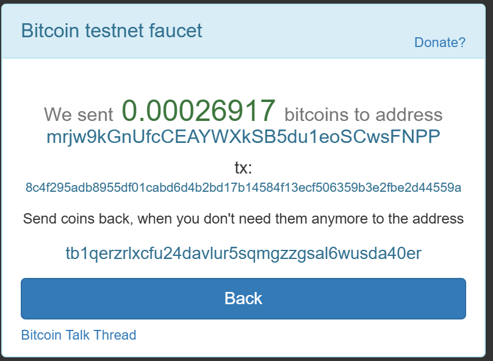
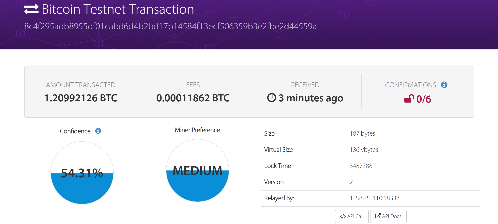
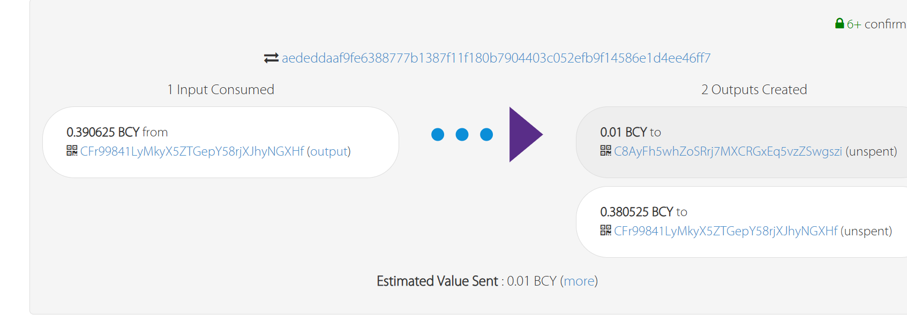

# keys.py

Alice

```shell
Private key: cNmvHb4PKqqYfcSqn2fYXT24eYVorpEuE8P74DPmUAZMw7F5jGuj
Address: mrjw9kGnUfcCEAYWXkSB5du1eoSCwsFNPP
```

Bob

```shell
Private key: cUaHgy7dvDm3b3shFPU6VBXd6Jv6q176FHBP1u2sXWA1dePpO9p3
Address: mmjoy4sU72BmkgF9QTVuA9Q4A2uMgRTbVn
```

# BTC

为Alice在BTC上领取测试币

https://live.blockcypher.com/btc-testnet/tx/8c4f295adb8955df01cabd6d4b2bd17b14584f13ecf506359b3e2fbe2d44559a/

领币成功



分币为10笔交易

```json
201 Created
{
  "tx": {
    "block_height": -1,
    "block_index": -1,
    "hash": "90097821d25dfab51e56fdcf62735381d644acdeb3f9a765a3a21f5c3cba72ef",
    "addresses": [
      "mrjw9kGnUfcCEAYWXkSB5du1eoSCwsFNPP"
    ],
    "total": 300,
    "fees": 26617,
    "size": 497,
    "vsize": 497,
    "preference": "low",
    "relayed_by": "111.33.78.6",
    "received": "2024-11-23T17:13:34.60994977Z",
    "ver": 1,
    "double_spend": false,
    "vin_sz": 1,
    "vout_sz": 10,
    "confirmations": 0,
    "inputs": [
      {
        "prev_hash": "8c4f295adb8955df01cabd6d4b2bd17b14584f13ecf506359b3e2fbe2d44559a",
        "output_index": 1,
        "script": "473044022006e960a18b03a378424e82049975a549b797d721521ac09c2e8e15974ddae8cf022074ad6bcac17e7385f256afa301b8617787b6c2937f714db6a81d85aedc4fd237012103c064596880c1aff1e77c8875cf507f92aecd2a7a8e865f6edda10f9242e3659c",
        "output_value": 26917,
        "sequence": 4294967295,
        "addresses": [
          "mrjw9kGnUfcCEAYWXkSB5du1eoSCwsFNPP"
        ],
        "script_type": "pay-to-pubkey-hash",
        "age": 0
      }
    ],
    "outputs": [
      {
        "value": 30,
        "script": "76a9147b1dd63903518a5db143091465036a343f74bf2788ac",
        "addresses": [
          "mrjw9kGnUfcCEAYWXkSB5du1eoSCwsFNPP"
        ],
        "script_type": "pay-to-pubkey-hash"
      },
      {
        "value": 30,
        "script": "76a9147b1dd63903518a5db143091465036a343f74bf2788ac",
        "addresses": [
          "mrjw9kGnUfcCEAYWXkSB5du1eoSCwsFNPP"
        ],
        "script_type": "pay-to-pubkey-hash"
      },
      {
        "value": 30,
        "script": "76a9147b1dd63903518a5db143091465036a343f74bf2788ac",
        "addresses": [
          "mrjw9kGnUfcCEAYWXkSB5du1eoSCwsFNPP"
        ],
        "script_type": "pay-to-pubkey-hash"
      },
      {
        "value": 30,
        "script": "76a9147b1dd63903518a5db143091465036a343f74bf2788ac",
        "addresses": [
          "mrjw9kGnUfcCEAYWXkSB5du1eoSCwsFNPP"
        ],
        "script_type": "pay-to-pubkey-hash"
      },
      {
        "value": 30,
        "script": "76a9147b1dd63903518a5db143091465036a343f74bf2788ac",
        "addresses": [
          "mrjw9kGnUfcCEAYWXkSB5du1eoSCwsFNPP"
        ],
        "script_type": "pay-to-pubkey-hash"
      },
      {
        "value": 30,
        "script": "76a9147b1dd63903518a5db143091465036a343f74bf2788ac",
        "addresses": [
          "mrjw9kGnUfcCEAYWXkSB5du1eoSCwsFNPP"
        ],
        "script_type": "pay-to-pubkey-hash"
      },
      {
        "value": 30,
        "script": "76a9147b1dd63903518a5db143091465036a343f74bf2788ac",
        "addresses": [
          "mrjw9kGnUfcCEAYWXkSB5du1eoSCwsFNPP"
        ],
        "script_type": "pay-to-pubkey-hash"
      },
      {
        "value": 30,
        "script": "76a9147b1dd63903518a5db143091465036a343f74bf2788ac",
        "addresses": [
          "mrjw9kGnUfcCEAYWXkSB5du1eoSCwsFNPP"
        ],
        "script_type": "pay-to-pubkey-hash"
      },
      {
        "value": 30,
        "script": "76a9147b1dd63903518a5db143091465036a343f74bf2788ac",
        "addresses": [
          "mrjw9kGnUfcCEAYWXkSB5du1eoSCwsFNPP"
        ],
        "script_type": "pay-to-pubkey-hash"
      },
      {
        "value": 30,
        "script": "76a9147b1dd63903518a5db143091465036a343f74bf2788ac",
        "addresses": [
          "mrjw9kGnUfcCEAYWXkSB5du1eoSCwsFNPP"
        ],
        "script_type": "pay-to-pubkey-hash"
      }
    ]
  }
}
```

# BCY

注册账户获取API token

```shell
Alice:7fd067d5ba3f45dcbd69a9accdb63d80
Bob:edd09d454064449e9eba503252f1bfc0
```


创建密钥

Alice

```shell
>curl -X POST https://api.blockcypher.com/v1/bcy/test/addrs?token=edd09d454064449e9eba503252f1bfc0
{
  "private": "5e5270a7adba1fd5de9f2f108b5c8fee1c700145ab840a37ad89ff77bf985d28",
  "public": "02159a749dbb956217d6f0d4401bbf0e34178f26dc9aa74eb8ce6b96b85df8fdfa",
  "address": "C2LDuH2Jz2LqWFLn5s6UvLk4SaX3ZCjLRG",
  "wif": "BrVP2BhXSXhRidShr2WxUnZgybdKf8Fq2esk62z5HBv6WUoHrz5z"
}
```

Bob

```shell
>curl -X POST https://api.blockcypher.com/v1/bcy/test/addrs?token=edd09d454064449e9eba503252f1bfc0
{
  "private": "38e2a9ad1d9faaccefc229765c1598a660a40a9776930843505941cd6b3bf836",
  "public": "03269d53c5eb3452425f8dda43b36cc3b9c85f04ceb451c648de8257895b7ae5bb",
  "address": "C8AyFh5whZoSRrj7MXCRGxEq5vzZSwgszi",
  "wif": "BqEcFTWmD4SGbUetRS6TSGgJVxVCz4ThU83hwCmqGuvFygxWDtk8"
}
```

为Bob的BCY地址领取测试币

```shell
C:\Users\孙启森>curl -d "{\"address\": \"C8AyFh5whZoSRrj7MXCRGxEq5vzZSwgszi\", \"amount\": 1000000}" https://api.blockcypher.com/v1/bcy/test/faucet?token=edd09d454064449e9eba503252f1bfc0
{
  "tx_ref": "aededdaaf9fe6388777b1387f11f180b7904403c052efb9f14586e1d4ee46ff7"
}
```
领币成功


# 练习

## A

```python
def coinExchangeScript(public_key_sender, public_key_recipient, hash_of_secret):
    return [
        # fill this in!

    ]
```

## B

### a

```PYTHON
def coinExchangeScriptSig1(sig_recipient, secret):
    return [
        # fill this in!
        secret,
        sig_recipient
    ]

```

### b

```PYTHON
def coinExchangeScriptSig2(sig_sender, sig_recipient):
    return [
        # fill this in!
        sig_sender,
        sig_recipient
    ]
```

## C
获取区块高度

```python
# Get current block height (for locktime) in 'height' parameter for each blockchain (and put it into swap.py):
#  curl https://api.blockcypher.com/v1/btc/test3
btc_test3_chain_height  = 1439691#都要获取实时的

#  curl https://api.blockcypher.com/v1/bcy/test
bcy_test_chain_height   = 2062296
```
设置lock_time
```python
alice_locktime = 5
bob_locktime = 3
```
这里设置alice的锁定时间为5个区块，Bob的为3个区块，这里BOb的锁定时间少于Alice。可以让Alice尽快提供secret。从而确保交易的原子性、防止恶意行为、确保交易的顺利进行、防止网络延迟以及确保资金安全。
运行swap.py

```python
这里首先设置为不进行广播，并且回退交易
broadcast_transactions = False
alice_redeems = False
```
output

```shell

```

```python
接下来设置为进行交易
broadcast_transactions = False
alice_redeems = True
```
output

```shell

```

```python
broadcast_transactions = True
alice_redeems = False
```

output

```shell

```

```python
broadcast_transactions = True
alice_redeems = True
```
output

```shell

```


  

## D

### a 解释代码内容，以及coinExchangeScript是如何工作

本次实验中补充的代码主要由两部分组成

* 第一部分是一些密钥等的补充，按照实验指导说明一步步完成即可。

  * 此处遇到的问题是Windows中cmd对单引号的不支持，经过对其进行转义后得以修复。

* 第二部分为交易脚本的编写

  * coinExchangeScript

    ```python
    def coinExchangeScript(public_key_sender, public_key_recipient, hash_of_secret):
        return [
        ]
    ```


  * coinExchangeScriptSig1

    ```python
    def coinExchangeScriptSig1(sig_recipient, secret):
        return [
            # fill this in!
        	secret,
        	sig_recipient
        ]
    ```

    * 这种情况实现接收者知道秘密x的情况下赎回交易

  * coinExchangeScriptSig2

    ```python
    def coinExchangeScriptSig2(sig_sender, sig_recipient):
        return [
            # fill this in!
        	sig_recipient,
        	sig_sender
        ]
    ```

    * 这种情况下可以在双方都同意的情况下赎回交易

### b 以Alice用coinExchangeScript向Bob发送硬币为例

#### 1）如果Bob不把钱赎回来，Alice为什么总能拿回她的钱？

* 采用了时间锁的机制，当在设定的锁定时间内没有完成时，Alice就可以解锁自己的回退交易，从而将自己的钱拿回。
#### 2）为什么不能用简单的1/2 multisig来解决这个问题？

* 1/2 multisig 无法结合时间锁定和哈希锁定来保证交易的原子性。如果使用了1/2 multisig，可能会发生连续赎回自己发出的钱和对方发送的钱的问题。

### c 解释Alice (Bob) 创建的一些交易内容和先后次序，以及背后的设计原理。


### d 以该作业为例，一次成功的跨链原子交换中，数字货币是如何流转的？如果失败，数字货币又是如何流转的？

* 成功
  1. 首先双方在对应的网络创建了交易，Alice的BTC在btc网络，而Bob的BCY在BCY网络。
  2. 接着由Alice用secret解锁BOb的交易。这时Bob的BCY就已经到了Alice手中。同时这时Bob获取到了secret，通过secret解锁Alice的交易，从而得到btc。
* 失败
  1. 同样是双方先创建了交易
  2. 当交易失败后，经过了对应的时间锁，Alice的货币就会回到自己的手中，仍旧是btc，交换失败。同样的，Bob的BCY也会回到自己手中，得不到想要的btc。
